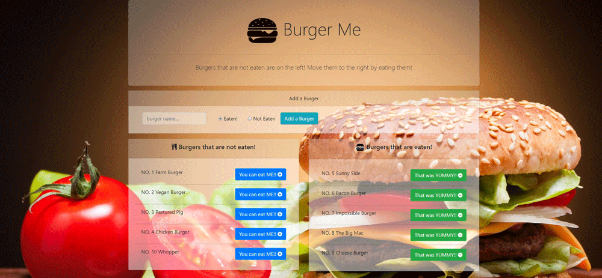

# Node Express Handlebars application

#### This application connects to a database, you can add burgers, and move them from one table to another

## Use Instructions

1. To run this app, you'll need to install the following Node packages.

   * [Body Parser](https://www.npmjs.com/package/body-parser) run _npm install body-parser_ 
   
   * [Express](https://www.npmjs.com/package/express) run _npm install express_ 
      
   * [Express Handlebars](https://www.npmjs.com/package/express-handlebars) run _npm install express-handlebars_ 
   
   * [mysql](https://www.npmjs.com/package/mysql) run _npm install mysql_ 

2. You will need to set up the database. Use the files named "[/db/schema.sql](/db/schema.sql)" and "[/db/seeds.sql](/db/seeds.sql)" located in this repo.
   * _If you want the database without any demo data use the file named "[/db/schema.sql](/db/schema.sql)" located in this repo._
   * _If you want to edit the default demo data or add your own demo data, use or edit the file named "[seeds.sql](/seeds.sql)" located in this repo._

3. Once you have your database set up, you can edit the database configs at the top of the file listed below for your specific environment. 

    _Edit lines 10 to 14 in "[/config/connection.js](/config/connection.js)"_

## Configure your Database    

```javascript
  host: "localhost",

  // Your port; if not 3306
  port: 3306,

  // Your username
  user: "root",

  // Your password
  password: "",
  database: "burgers_db"
```

4. Once your files are set up you can start using the app.

5. Explore the functionaliy of the front end by running the command " _node server.js_ " and visiting "[http://localhost:8080](http://localhost:8080)" 

6. The app is also configured to run in heroku, just create an AWS database using the heroku app JAWS_DB and upload the tables.

## Front end




###### Thanks for checking out my project! If you have any questions get in touch!
